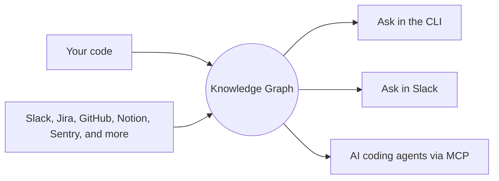

<div align="center">

<h1>OYNIX</h1>

**Nothing your team builds or decides ever disappears.**

A graph-native knowledge layer for engineering teams — your code, decisions, and
conversations captured in one living, queryable graph.

[](https://oynix.dev)
[](https://oynix.dev/docs)
[](https://oynix.dev/blog)
[](https://oynix.dev/#waitlist)

</div>

---

## The problem

Engineering knowledge rarely disappears in a dramatic outage — it erodes quietly,
one departure at a time. The code stays in the repo; the *reasoning* behind it
walks out the door. Why is the retry capped at three? Why does billing skip the
queue for enterprise? Six months later, nobody's sure.

Most fixes don't hold: wikis go stale, docs lag the code, and the answer is buried
in a Slack thread that scrolled away. **Oynix keeps the context where it can't get
lost — and makes it answerable.**

## How it works



Oynix indexes your codebase into a graph of **real relationships** — functions,
files, and the calls/reads/writes between them — then links that graph to the
pull requests, tickets, and conversations that explain *why* the code exists.
Ask it anything, in plain English, from wherever you already work.

## What it does

| | |
|---|---|
| 🧠 **Understands code, doesn't just search it** | Purpose-built parsers for **30+ languages** turn each file into structure, so answers follow real call chains — not keyword coincidences. |
| 🔌 **Connects your whole stack** | Every source ingested into one graph and linked to the code it shaped. |
| 💬 **Answers with receipts** | Ask in the CLI or Slack and get a grounded answer with the exact sources it used — never a confident guess. |
| 🔒 **Local-first & BYOK** | The engine and graph run inside *your* infrastructure; your code and keys never leave it. |
| 🤖 **Built for AI agents** | Runs as an MCP server, so your coding agents start every session with real context. |
| 👥 **Team-aware** | Real-time presence, ownership, and the decisions behind the code — shared across the org. |

## Integrations

| Category | Connectors |
|---|---|
| **Code hosts** | GitHub · GitLab · Bitbucket |
| **Comms** | Slack · Microsoft Teams |
| **Docs** | Notion · Confluence · Google Docs |
| **Issues** | Jira · Linear |
| **Observability & data** | Sentry · Firebase · Supabase |
| **Analytics** | Mixpanel · CleverTap |
| **Anything else** | via MCP |

## Works with your coding agent

Oynix runs as an MCP server, so it plugs into the agents your team already uses —
**Claude Code, Cursor, VS Code, Windsurf, Zed**, and more — one command writes the
right config per host:

```bash
oynix mcp setup --client claude   # or cursor | vscode | windsurf | … | all
```

## Get started

```bash
oynix login            # sign in
oynix init             # configure this machine (BYOK / BYODB)
oynix key setup        # join or create your workspace
oynix engine start     # bring up your local knowledge graph
oynix index owner/repo # index a repo
oynix ask "how does login work?"
```

Full command reference → **[oynix.dev/docs](https://oynix.dev/docs)**

## Status

Oynix is in **private beta**. → **[Join the waitlist](https://oynix.dev/#waitlist)**

<div align="center">

— *Nothing is lost.*

</div>
